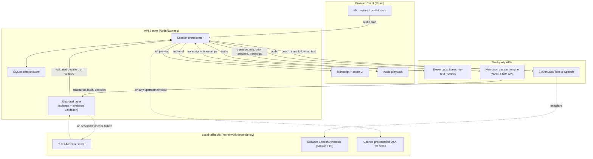

# 01 — Architecture

> Components, data flow, tech stack, repo structure. Track-evidence mapping at the bottom.

## Components

| Component | Responsibility | Inputs | Outputs | Failure mode & handling |
|---|---|---|---|---|
| **Browser client** (React) | Push-to-talk capture, playback, transcript UI, state-machine UI, retry/compare view | Mic audio (MediaRecorder), server responses | Audio blob (webm/opus) to server, rendered UI | Mic permission denied → inline instructions + typed fallback input (logged as `text_fallback`) |
| **API server** (Node/Express) | Orchestrates pipeline: audio → ElevenLabs STT → Nemotron → ElevenLabs TTS → session state → one payload back | Audio blob, session_id | JSON: transcript, Nemotron decision object, TTS audio URL/base64 | Any upstream timeout (>6s) → cached fallback for current question index; fallback is signaled in-band (`degraded: true` + `degraded_components`, per `02-interfaces.md`); return `504 UPSTREAM_TIMEOUT` only if fallback cannot serve |
| **ElevenLabs STT** (Scribe) | Audio → transcript with timestamps | Audio blob | Transcript + word timestamps + confidence | Confidence <0.6 → show transcript with "Confirm this is what you said" edit box before scoring |
| **Nemotron decision engine** | Per turn: probe-further vs. finalize (≤2 follow-ups); on finalize: score 0–100, category, explanation + "what was great" + 2–3 tips, evidence-grounded | Question, role, prior turns, current transcript | Fixed-schema JSON (see `02-interfaces.md`) | Malformed JSON → 1 retry with `response_format` forced; still bad → rules-baseline fallback, tagged `evaluator: "fallback_rules"` |
| **ElevenLabs TTS** | `follow_up_text` / `coach_cue` → spoken audio | Text, voice_id | MP3/PCM stream | Timeout/quota → browser `SpeechSynthesisUtterance` fallback, UI shows "backup voice" badge |
| **Session store** (SQLite via better-sqlite3) | Persists session, scores, transcript, evidence spans, retry pair | Writes from API server | Reads for dashboard/eval export | Single-writer demo scale — non-issue; fallback is in-memory `Map` keyed by session_id |
| **Guardrail layer** (server-side pure functions) | Validates Nemotron JSON: schema, evidence substring present in transcript, enum whitelists, feedback caps | Raw Nemotron JSON, raw transcript | Validated/repaired JSON or fallback object | Any validation failure → replaced by rules-baseline fallback, never silently patched |
| **Eval harness** (standalone Node script, offline) | Runs labeled synthetic dialogues through rules-baseline, generic-prompt, Nemotron pipeline; computes metrics | `eval/dataset.json` | `eval/results.json` + printed table | N/A — offline, no live-demo dependency |

## Component diagram



## End-to-end data flow

1. **Start:** client POSTs `/session/start` → server creates `session_id`, loads question 1 of 5, TTSes the question, returns audio + `question_index: 0`.
2. Client plays interviewer audio; candidate holds push-to-talk and speaks.
3. Client POSTs audio blob to `/session/:id/answer` with `question_index`, `turn_number` (0 = first response, increments per follow-up).
4. Server → ElevenLabs STT → transcript + confidence. If confidence <0.6, return transcript for confirm/edit via `/session/:id/confirm-transcript`.
5. Server → Nemotron with `{role, question, full_dialogue_so_far, turn_number}` → raw JSON decision.
6. Guardrail validates (schema, enums, evidence substring). Valid → pass through. Invalid → rules-baseline fallback tagged `evaluator: "fallback_rules"`.
7. Route on `next_action`:
   - `ask_follow_up` (only if `turn_number < 2`, enforced in code) → TTS `follow_up_text`, increment turn.
   - `finalize_question` → response already contains score/category/explanation/tips/evidence. TTS transition line, advance question, reset turn to 0.
8. Server persists turn, returns full payload.
9. Client renders transcript live; score + feedback bundle only on finalize (no score shown mid-question, mirrors the reference product).
10. After 5 finalize: session synthesis — `total_score` (mean), overall category, conclusion, aggregate strengths/growth areas; `certificate_unlocked = total_score >= 50`.
11. Weakest finalized question → `retry_target`.
12. Client shows summary screen, then **Retry**: replays weakest question's top tip via TTS, candidate re-records from scratch.
13. Server re-runs the pipeline on the retry dialogue, returns before/after diff.
14. Client renders the comparison — the moment the demo is built around.

## Where each track's evidence lives

- **ElevenLabs:** steps 2–4 and 7 — STT and TTS are in the critical path of every turn. The "backup voice" badge proves the sponsor tech is load-bearing (the fallback is visibly worse).
- **Nemotron:** steps 5–7 — the engine sits *between* transcript and UI, returning machine-readable routing decisions the state machine executes verbatim. Never chats with the user; TTS speaks, Nemotron decides *what* gets spoken, *what score results*, *what happens next*. Raw JSON shown on-screen in the demo.
- **Seed Round:** the retry loop (steps 12–14) + session summary (step 10) are live working evidence, not slides; wedge/buyer/next-step named in the pitch.

## Tech stack

| Layer | Choice | Why (24h) | Fallback |
|---|---|---|---|
| Language | TypeScript (Node 20 LTS), server + client | One language, no context-switch tax | Drop to plain JS if TS friction eats time |
| Frontend | React 18 + Vite | Fast dev server, HMR, no SSR | Single-file vanilla HTML/JS |
| Frontend audio | `MediaRecorder` (webm/opus) | Native, zero deps | `AudioContext` → WAV if codec unsupported |
| State | React `useState`/`useReducer` only | 5-question linear machine needs no Redux | N/A |
| Backend | Express (Node) | Minimal boilerplate | Fastify, same route shapes |
| Audio upload | `multer` multipart → temp file → base64 | Simple, documented | Manual buffer read |
| Storage | SQLite via `better-sqlite3` (`data/session.db`) | Zero setup, sync API | In-memory `Map<session_id, state>` |
| Hosting | **Local only** — server `localhost:8080`, client `localhost:5173` (Vite proxies `/api`) | No deploy flakiness, DNS, cold starts, or venue-Wi-Fi risk | `ngrok http 5173` at hour 22 if a public URL is required |
| STT | ElevenLabs `POST /v1/speech-to-text`, `scribe_v1` | Sponsor req; word timestamps for evidence spans | Browser Web Speech API, tagged `transcript_source: "browser_stt"` (+ `degraded_components: ["stt"]`) |
| TTS | ElevenLabs `POST /v1/text-to-speech/{voice_id}`, `eleven_turbo_v2_5` | Sponsor req; turbo = lowest latency | Browser `SpeechSynthesisUtterance` |
| LLM | Nemotron `POST https://integrate.api.nvidia.com/v1/chat/completions`, `nvidia/llama-3.1-nemotron-70b-instruct`, `response_format: json_object` | Sponsor req; OpenAI-compatible so the standard SDK works | Rules-baseline scorer, zero network |
| Config | `.env` + `dotenv` | Standard | N/A |
| Process mgmt | `concurrently` (`npm run dev` runs both) | One terminal, one command | Two terminals manually |

**Env vars** (server unless noted): `ELEVENLABS_API_KEY`, `ELEVENLABS_VOICE_ID` (one pre-made neutral voice, picked once — no voice-hunting at the venue), `NEMOTRON_API_KEY`, `NEMOTRON_MODEL` (default `nvidia/llama-3.1-nemotron-70b-instruct`), `PORT` (8080), `DB_PATH` (`./data/session.db`), `USE_BROWSER_STT_FALLBACK` (client build-time flag).

## Repository structure

```
interview-voice-coach/
├── .env.example / .gitignore / README.md / package.json
├── docs/
│   ├── architecture.png              # exported mermaid diagram, for submission
│   ├── decision-schema.json          # canonical Nemotron output schema
│   └── failure-story.md              # the one documented miss + fix, for judges
├── eval/
│   ├── dataset.json / edge_cases.json
│   ├── run_eval.ts
│   └── results.json                  # checked in after the one pre-demo run
├── server/src/
│   ├── index.ts                      # Express bootstrap, CORS for localhost:5173
│   ├── db.ts                         # better-sqlite3 + migrations
│   ├── routes/session.ts             # POST /session/start, GET /session/:id
│   ├── routes/answer.ts              # POST /session/:id/answer, /confirm-transcript
│   ├── routes/retry.ts               # POST /session/:id/retry
│   ├── services/elevenlabs.ts        # transcribe(), synthesize()
│   ├── services/nemotron.ts          # probeOrFinalize() -> raw JSON, 1 retry
│   ├── services/sessionSynthesis.ts  # aggregateSession()
│   ├── services/rulesBaseline.ts      # pure-function fallback scorer
│   ├── guardrails/schema.ts          # zod schema
│   ├── guardrails/evidenceCheck.ts    # substring validation
│   ├── guardrails/validate.ts        # orchestration -> validated-or-fallback
│   ├── stateMachine/interview.ts     # question order, 2-follow-up cap (code-enforced), retry target
│   ├── data/questions.ts             # 5 fixed questions + keyword hints
│   ├── data/categories.ts            # Excellent 90-100 / Good 70-89 / Satisfactory 50-69 / Needs Work 0-49
│   ├── data/cachedFallback.json      # prerecorded session for network-outage demo
│   └── prompts/nemotronPrompts.ts    # exact prompt strings, single source of truth
├── client/src/
│   ├── App.tsx                       # state machine UI router
│   ├── components/                   # SetupScreen, RecordButton, TranscriptView, ScoreCard,
│   │                                 # FeedbackBundle, FollowUpBanner, SessionSummary,
│   │                                 # RetryCompare, DecisionJsonPanel (raw-JSON viewer for judges)
│   └── lib/api.ts / lib/audio.ts
└── scripts/seed-cached-fallback.ts   # records a real session into cachedFallback.json
```
